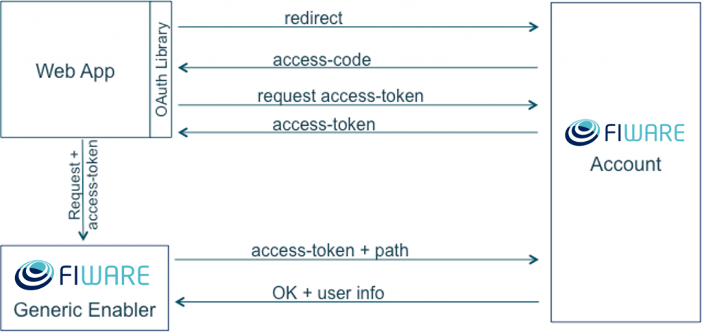
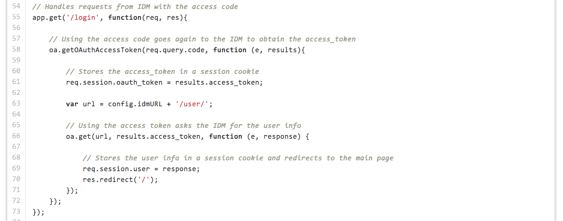

If your web app is going to use a FIWARE GE service you have to
authenticate the requests.

Once you have obtained an Oauth2 access‐token you have to include it in
your client requests in order to authenticate them. This way the GE will
check your token with the IDM and decide if your requests are valid. The
architecture of this flow is:

So for include the access‐token in your requests you have to do:

GET /GE\_URL\_path HTTP/1.1  
 Host: GE\_hostname  
 X-­Auth-Token: access\_token

For instance, using our OAuth2 example explained previously, you can get
the access\_token in this code fragment:

 

 
